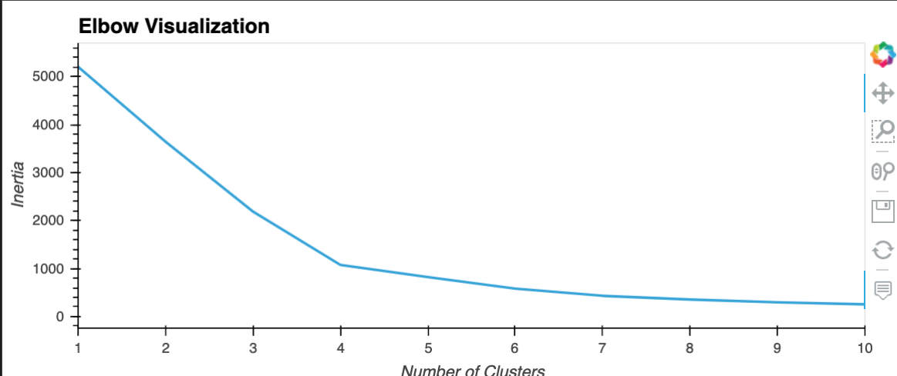
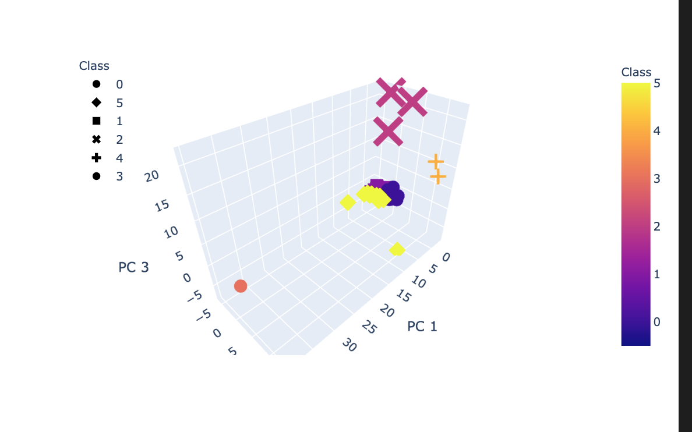
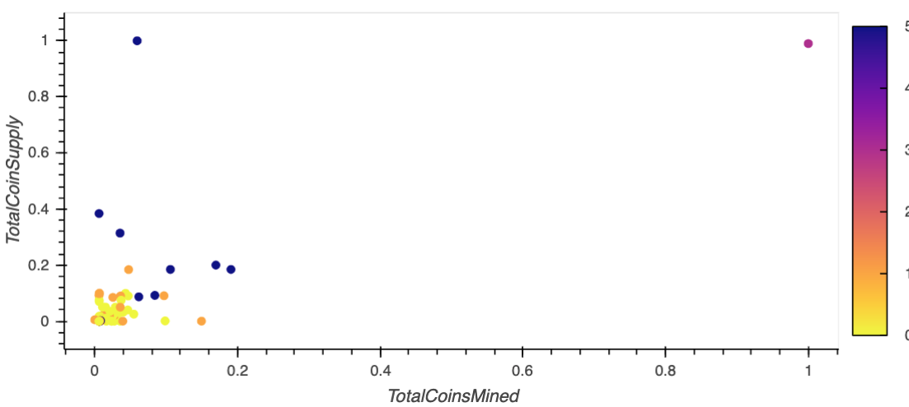

# Cryptocurrencies Market Analysis

The Advisory Services Team at Accountability Accounting, a prominent investment bank, is interested in offering a new cryptocurrency investment portfolio for its customers. They are looking for an investment report by grouping and classifying certian cryptocurrencies that are on the trading market. 
We are using a clustering algorithm to perform the analysis and report to the Advisory Services Team.
  
## Processing and Analysis

We first start with data preprocessing by
- Null values are handled.
- Only numerical data is used.
- Values are scaled. In other words, data has been manipulated to ensure that the variance between the numbers won't skew results.

  
We used PCA to reduce the feature dimensionality. 

The next step is to identify what would be the ideal number of clusters that we should group the crytocurrencies. Using the Elbow curve, it is determined that ideal number of clusters would be 6. 
 
 

We then created a 3D-Scatter plot with the PCA data and the clusters : 

Further we scale TotalCoinsMined and TotalCoinSupply columns and plot the graph using a scatter plot. 

